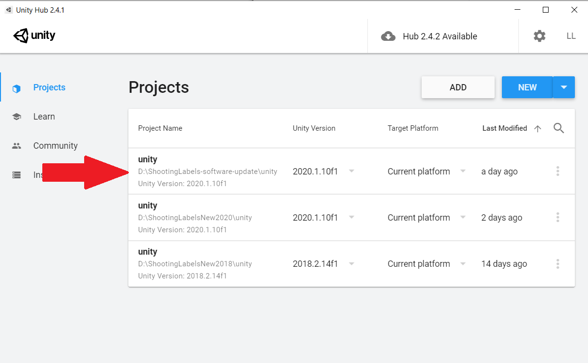
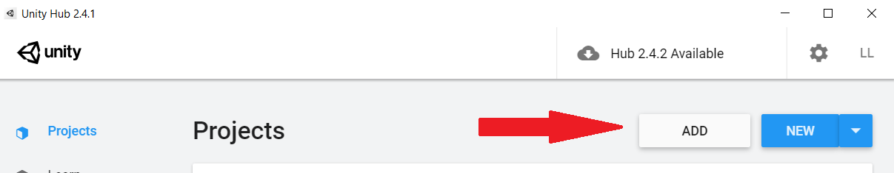
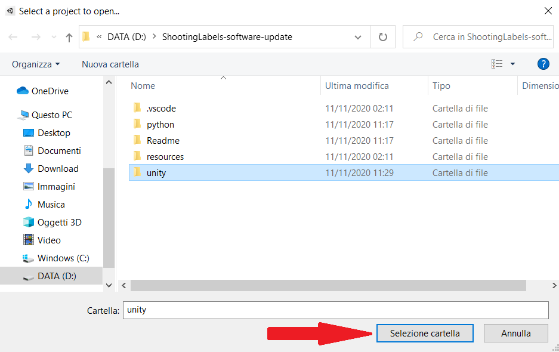

# Shooting Labels 


## [[Paper]](https://arxiv.org/abs/1910.05021) [[Project Page]](https://cvlab-unibo.github.io/shootinglabelsweb/) [[Video]](https://youtu.be/96vsTui8ZLg)

## Citation
If you find our work useful in your project please consider citing our paper:

```
@inproceedings{ramirez2020shooting,
  title={Shooting labels: 3D semantic labeling by virtual reality},
  author={Ramirez, Pierluigi Zama and Paternesi, Claudio and De Luigi, Luca and Lella, Luigi and De Gregorio, Daniele and Di Stefano, Luigi},
  booktitle={2020 IEEE International Conference on Artificial Intelligence and Virtual Reality (AIVR)},
  pages={99--106},
  year={2020},
  organization={IEEE}
}

```

### Requirements
* Python with open3d library (version 0.5.0.0)
* Blender 2.79b
* Unity recommended 2018.2
* SteamVR
* HTC VIVE
* OS Windows 8.1 or higher

### How to install 
For the preprocess phase we will use a python script which implements the open3d library so, in order, we have to:
1) Install [Python](https://www.python.org/downloads/)
2) Install the open3d library by writing in the windows power shell:
```
pip3 install open3d-python==0.5.0.0
```
Now install [Blender](https://download.blender.org/release/Blender2.79/) choosing version 2.79b for Windows. After that make sure you can run this application using the shell (type "blender" in WPS. The application should open). If not add the blender path to the environment variables.

Unity will be used as a game enigne so we need to install it. First, download and install the [Unity Hub](https://unity3d.com/get-unity/download) and then, form the [Unity Archive](https://unity3d.com/get-unity/download/archive), choose a version (recommended 2018.2), it will install automatically.

To label, we need the HTC VIVE. This device needs a program to work, [SteamVR](https://store.steampowered.com/app/250820/SteamVR/) available on Steam. 


### How to use
##### Preprocess
In this phase, starting from the point cloud or mesh we will obtain its division and its voxelization.

Open the therminal, navigate to your folder and launch the command followed by the flags. The flags also have a default value. 

 ```
 cd path_to_your_folder
 ```
 Path_to_your_folder is the path to your python folder.

```
python preprocess.py --flag1 valueflag1 --flag2 valueflag2 --flag3 valueflag3 ...  
```

The flags are:

``` --input_path``` is the path to the file .ply

``` --output_path``` is the path to the output folder

``` --split_x``` splits along x axis (default: 1)

``` --split_y``` splits along y axis (default: 1)

``` --split_z``` splits along z axis (default: 1)

``` --mode_split``` number or dimension (default: number) splitting the ply in x,y,z parts or every x,y,z meters

``` --object_type``` mesh or pointcloud (default: pointcloud) 

``` --skip_split``` skip splitting operation 

``` --template_path``` path to the empty blender template file (default: ../resources/template.blend)

``` --step_0``` discretization step LOD 0 (default: 0.25)

``` --step_1``` discretization step LOD 1 (default: 0.50)

``` --step_2``` discretization step LOD 2 (default: 1.00)

``` --threshold_voxels``` minumun number of point to create a voxel (default: 5)


You can find the output of this procedure in the selected path. Copy and paste the content of the LODS folder in the following path "unity\Assets\Resources\Models\Meshes\Empty". If the "Empty" folder doesn't exist you have to create one. Copy and paste the content of the split_ply folder in the following path "unity\Assets\Resources\Models\Meshes\RGB". If the "RGB" folder doesn't exist you have to create one. 

Now we are ready to start the application. 

##### In game
* First, you have to set the value of some variables, go in Assets/Resources and open the config file. The most important is pointcloud, set true if you wanna load a pointcloud or set false if you wanna load a mesh.
* Start SteamVR and make sure all the devices are correctly detected. 
* Open the Unity Hub panel.

* Click the Add Button:

* Browse to the local directory where the repository was downloaded to and click Select Folder:

When you start the application for the first time or when you want to load a new mesh for your project you have to load it. 
* Add openVr plugin, Window->Package Manager, select “OpenVR” in the package list and click install. Restart Unity
* Open the ``` Assets/Scenes/Menu``` within the Unity software.
* Now, by clicking the play button, you can start the software. 

Load the new mesh by clicking the "Load New Mesh" Button or if the mesh is already loaded start a new game by clicking "New Session". 
To learn the controls you can use the "Tutorial".
When you finish labeling you can choose between "Save", and continue the project later (choose Load Last Save in the Main Menu), or "Export", in order to export your files. If you choose "Save", your files will be stored in "unity/Assets/Data/Saves". If you choose "Export" you will find your files in "unity/Assets/Data/Export".

## Aknowlodgments 

We gratefully thank _Consorzio T3Lab_ for their fundings.
